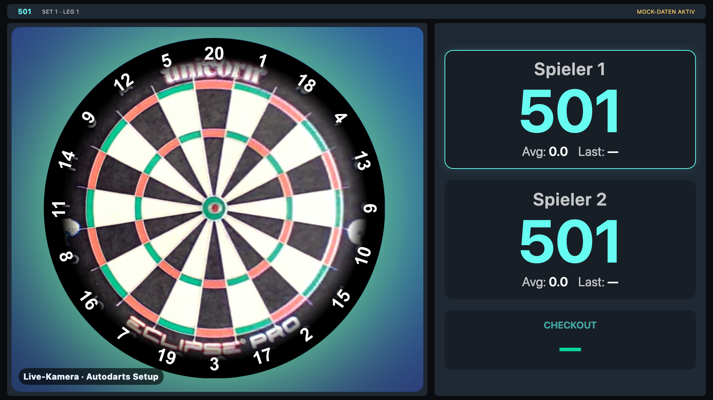

# Release Candidate 1: Webview Big Readable

Stand: 2026-06-13

## Ergebnis

Diese Variante ist der erste visuell bestätigte Release Candidate für das Autodarts-Dashboard im Querformat.

- links: großes, zentriertes Dartboard-/Kamerabild
- rechts: große Punkteanzeige
- Spielername, Score, Average, Last und Checkout sind auf Abstand besser lesbar
- basiert auf Layout `webview-big-readable`

## Preview

## Feedback-Status

Von 4plus17/Hauke als guter Zwischenstand bestätigt:

> So ist es aber super

## Noch offen

- echte Webview-/Kamera-Einbettung statt Screenshot-Crop final klären
- echte Autodarts-Datenquelle anbinden
- am echten Monitor/Dartboard-Abstand final testen
